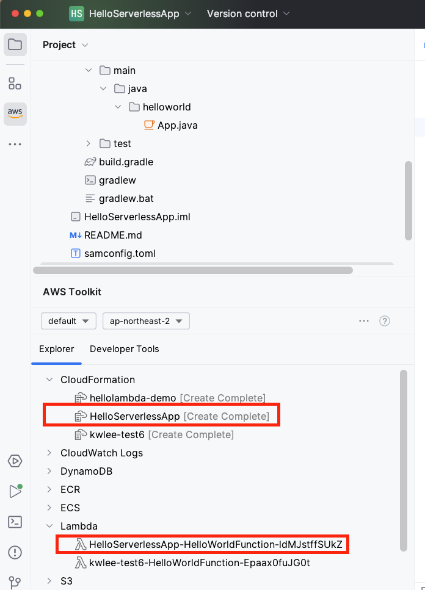

# AWS Lambda 시작하기
## 필수조건
- [AWS 계정 가입](https://portal.aws.amazon.com/billing/signup#/start/email)
- [AWS IAM 자격증명 설정](https://docs.aws.amazon.com/toolkit-for-jetbrains/latest/userguide/setup-credentials.html)

## 1. 콘솔로 AWS Lambda 함수 만들기
- 다음 [링크](https://docs.aws.amazon.com/lambda/latest/dg/getting-started.html)를 클릭하여 **콘솔로 Lambda 함수 만들기** 실습을 진행합니다.


## 2.	JetBrains 용 AWS Toolkit을 이용하여 AWS 서버리스 앱 만들기

### 2.1 환경설정
- AWS Serverless Application Model (SAM) CLI 설치
	- https://docs.aws.amazon.com/serverless-application-model/latest/developerguide/install-sam-cli.html
- Docker 설치
	- https://docs.docker.com/get-docker/ 
- JetBrains 용 AWS Toolkit 설정
 	- https://blog.jetbrains.com/idea/2022/02/aws-in-intellij-idea/
 	- https://docs.aws.amazon.com/toolkit-for-jetbrains/latest/userguide/getting-started.html

### 2.2 AWS Lambda를 포함한 서버리스 앱 생성, [로컬] 실행, 배포하기
1. 서버리스 앱 프로젝트 생성
	- IntelliJ IDEA IDE의 **File > New Project** 메뉴 선택 
	- **AWS > AWS Serverless Application** 선택 후, **Next** 클릭
2. 새 프로젝트 설정
	- **Project Name**: *HelloServerlessApp* 
	- 나머지는 항목은 기본값으로 유지 혹은 필요에 따라서 수정 가능
	- **Create** 클릭
3. 로컬에서 실행
	- [**필수**] Docker 프로세스가 실행된 상태이어야 함 (앞서 설치한 Docker를 실행)
	-  IntelliJ IDEA IDE의 화면 상단 타이틀 바에서 "[Local] HelloWorldFunction" 옆의 **연두색 실행 버튼 (삼각형)을 클릭**
	-  [**Edit Configuration**] 다이얼로그 화면에서 **Text -- Event Templates --** 부분의 드롭다운 메뉴 중에서 *API Gateway AWS Proxy*를 선택 후, **Run** 클릭
	-  콘솔 창에 다음 결과가 맨 마지막 줄에 출력되는 지를 확인
	
		```
		{"statusCode": 200, "headers": {"X-Custom-Header": "application/json", "Content-Type": "application/json"}, "body": "{ \"message\": \"hello world\", \"location\": \"112.169.157.31\" }"}
		```
4. AWS에 배포하기	
	- **HelloServerlessApp** 프로젝트 탐색창에서 **template.yaml**을 찾아서 선택하고, 선택된 상태에서 오른쪽 마우스 클릭하여 **SyncServerless Application (formerly Deploy)** 메뉴를 선택
	- [**Confir development stack**] 다이얼로그 화면에서 **Confirm** 선택
	- [**SyncServerless Application (formerly Deploy)**] 다이얼로그 화면에서, **Create Stack**에 적절한 이름(예, *HelloServerlessApp*)을 입력 후에, **Sync** 클릭
		- [**참고**] 한참 동안 진행이 안되면 현재 스텝을 한번더 수행해 본다.  
	- 콘솔 창에 다음 결과가 맨 마지막 줄에 출력되는 지를 확인

		```
		Build Succeeded
		
		Successfully packaged artifacts and wrote output template to file /var/folders/mq/rmstmfq90sg60yc_czppr4dh0000gn/T/tmpkk2i6l5q.
		Execute the following command to deploy the packaged template
		sam deploy --template-file /var/folders/mq/rmstmfq90sg60yc_czppr4dh0000gn/T/tmpkk2i6l5q --stack-name <YOUR STACK NAME>
		
		...
		```
	- **AWS Toolkit** 창의 탐색기에서 **CloudFormation**과 **Lambda**를 확장하여 *HelloServerlessApp*과 *HelloServerlessApp-HelloWorldFunction-XXX*이 생성되었는지를 확인한다.
	
		
5. 원격에서 실행하기
	- **AWS Toolkit** 창의 탐색기에서  **Lambda**를 확장하여 *HelloServerlessApp-HelloWorldFunction-XXX*선택하고, 오른쪽 마우스 클릭하여 **Run '[Remote] HelloServer...'**메뉴를 선택
	-  콘솔 창에 다음 결과가 맨 마지막 줄에 출력되는 지를 확인
		
		```
		Output: 
		{
		  "statusCode": 200,
		  "headers": {
		    "X-Custom-Header": "application/json",
		    "Content-Type": "application/json"
		  },
		  "body": "{ \"message\": \"hello world\", \"location\": \"13.124.22.48\" }"
		}
		```
		
---
<a name="3"></a>
## 3. Amazon SNS를 이용하는 Lambda 함수 만들기
### 3.1 Amazon SNS(Simple Notification Service)
- **Amazon SNS**란?
	- **마이크로서비스, 분산 시스템 및 서버리스 애플리케이션을 쉽게 분리**할 수 있게 해 주는 내구적이고 안전한 고가용성의 완전 관리형 게시/구독 메시징 서비스입니다.
	- **구독 중인 endpoint 또는 클라이언트에게 메시지 전달**을 조정 및 관리하는 웹 서비스입니다.


- [**AWS 실습**] [Amazon SNS 시작하기](https://docs.aws.amazon.com/ko_kr/sns/latest/dg/sns-getting-started.html)

<a name="3.2"></a>
### 3.2 Amazon SNS를 이용하여 이메일을 보내는 Lambda 함수 [**실습**]
1. AWS Serverless App 프로젝트를 Jetbrains 용 AWS Toolkit을 이용하여 생성한다.
	- **Project name**: *SNSLambdaTest*
2. [선택사항] 프로젝트내의 HelloWorld 문자열을 SNSLambda로 일부 변경
	- HelloWorldFunction 폴더 이름을 SNSLambdaFunction 로 변경 ( 폴더 이름을 선택 후, 오른쪽 마우스 클릭하여 **Refactor > Rename** 메뉴 사용)
	- template.yaml 파일내의  모든 HelloWorld 문자열을  SNSLambda로 변경
4. build.gradle 파일을 열고 다음 의존성을 추가하고, **변경사항을 반영**합니다.

	```
	dependencies {
		 ...
	    implementation platform('com.amazonaws:aws-java-sdk-bom:1.12.529')
	    implementation 'com.amazonaws:aws-java-sdk-sns'
	    ...
	}
	```
5. **src/main/java/helloworld/App.java** 파일을 아래 코드로 대체하고, **AccessKey**, **SecretKey**, **topicArn**을 여러분의 설정 값으로 변경하세요

	```
	package helloworld;
	
	import com.amazonaws.auth.AWSStaticCredentialsProvider;
	import com.amazonaws.auth.BasicAWSCredentials;
	import com.amazonaws.regions.Regions;
	import com.amazonaws.services.lambda.runtime.Context;
	import com.amazonaws.services.lambda.runtime.RequestHandler;
	import com.amazonaws.services.sns.AmazonSNS;
	import com.amazonaws.services.sns.AmazonSNSClientBuilder;
	import com.amazonaws.services.sns.model.PublishRequest;
	import com.amazonaws.services.sns.model.PublishResult;
	
	/**
	 * Handler for requests to Lambda function.
	 */
	public class App implements RequestHandler<Object, String> {
	
	    public String handleRequest(Object input, Context context) {
	        context.getLogger().log("Input: " + input);
	
	        final String AccessKey="chage-to-your-accesskey";
	        final String SecretKey="change-to-your-secretkey";
	        final String topicArn="change-to-your-topicArn"; // 이전 단계에서 생성한 SNS 주제에 대한 Arn을 지정
	
	        BasicAWSCredentials awsCreds = new BasicAWSCredentials(AccessKey, SecretKey);
	        AmazonSNS sns = AmazonSNSClientBuilder.standard()
	                .withRegion(Regions.AP_NORTHEAST_2)
	                .withCredentials( new AWSStaticCredentialsProvider(awsCreds) )
	                .build();
	
	        String msg = "If you receive this message, publishing a message to an Amazon SNS topic works.";
	        String subject = ""+input;
	        PublishRequest publishRequest = new PublishRequest(topicArn, msg, subject);
	        PublishResult publishResponse = sns.publish(publishRequest);
	
	        // TODO: implement your handler
	        return "SNS completed from Lambda!";
	    }
	}
	```
6. **src/test/java/helloworld/AppTest.java* 파일을 열고, successfulResponse() 코드를 지우던가, 오류가 난 부분을 적절히 수정한다.

7. 로컬에서 실행
	- [**필수**] Docker 프로세스가 실행된 상태이어야 함 (앞서 설치한 Docker를 실행)
	-  IntelliJ IDEA IDE의 화면 상단 타이틀 바에서 "[Local] HelloWorldFunction" 옆의 **연두색 실행 버튼 (삼각형)을 클릭**
	-  [**Edit Configuration**] 다이얼로그 화면에서 **Text -- Event Templates --** 부분의 드롭다운 메뉴 중에서 *API Gateway AWS Proxy*를 선택 
	-  데이터 창에 "*Hello From SNSLambdaFunction*" 문자열을 입력하고 **Run** 클릭
	-  콘솔 창에 다음 결과가 맨 마지막 줄에 출력되는 지를 확인
	
		```
		"SNS completed from Lambda!"
		```
	- SNS 주제에 구독중인 이메일로  "*Hello From SNSLambdaFunction*" 주제의 메시지가 도착했는지 확인한다.

8. 7번까지 정상적으로 수행되는 것이 확인되면, 배포하고, 원격에서 실행하여 동일한 결과가 나오는 지를 확인한다.
